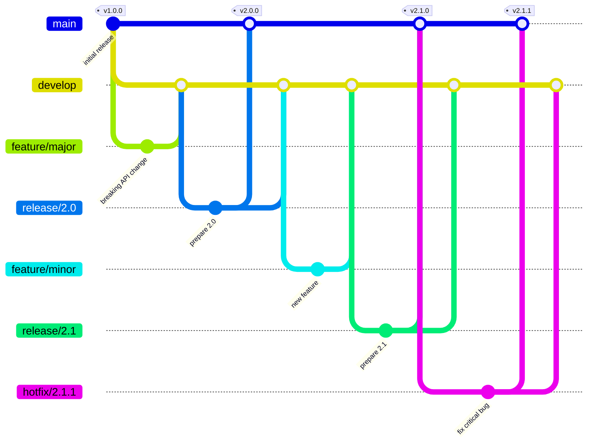
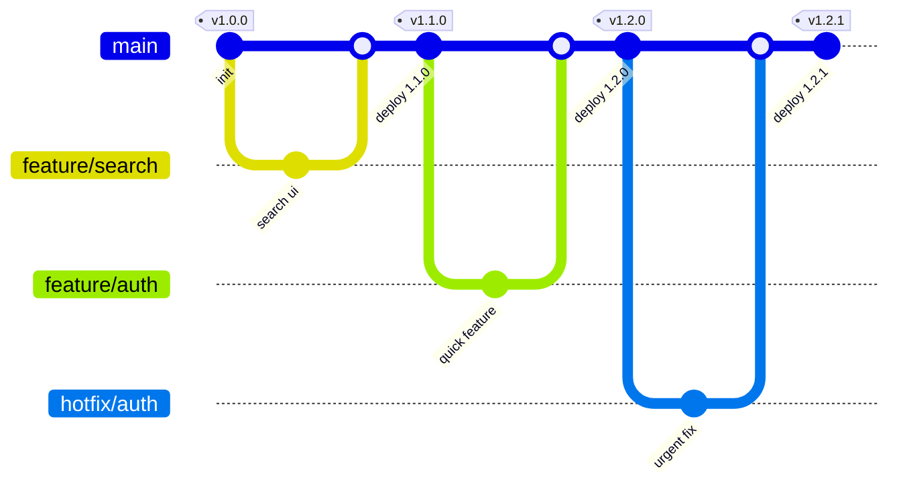

# Test

## Agile Development

The unit of work in agile development is a **user story** (or simply "story").

...

_Branching Strategy_

Agile development often uses **feature-branching**. One branching strategy for FB is **GitFlow**.

- The main branch is the **production branch** or **release branch**.
  - It is only modified for **hotfixes** (something that breaks production).
- A separate **development branch** is used for active development.
  - Features branch from a development branch (not the main branch).
  - Feature branches are merged into the development branch when completed.
  - The development branch is merged into the main branch when a **version cutoff** is reached. This is often the end of a sprint.

## Continuous Integration (CI)

The unit of work in CI is a **commit**. It does not have to be a completed feature.

...

_Branching Strategy_

CI uses **Trunk-based development**.

- Branches are created from the main branch. There is no development branch.
- Branches are extremely short-lived.
- Commits are merged into the main branch by each developer at least daily.
- This avoids merge conflicts and ensures the main branch is always releasable.

## Example

~.focusContent.example

**Example here**

/~

## Other Content

Other content here...
